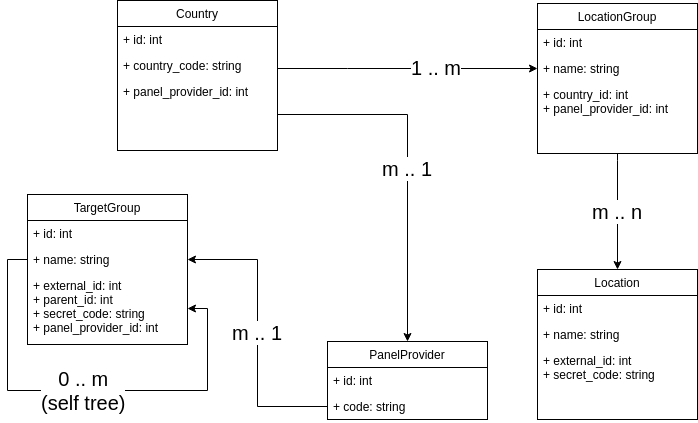
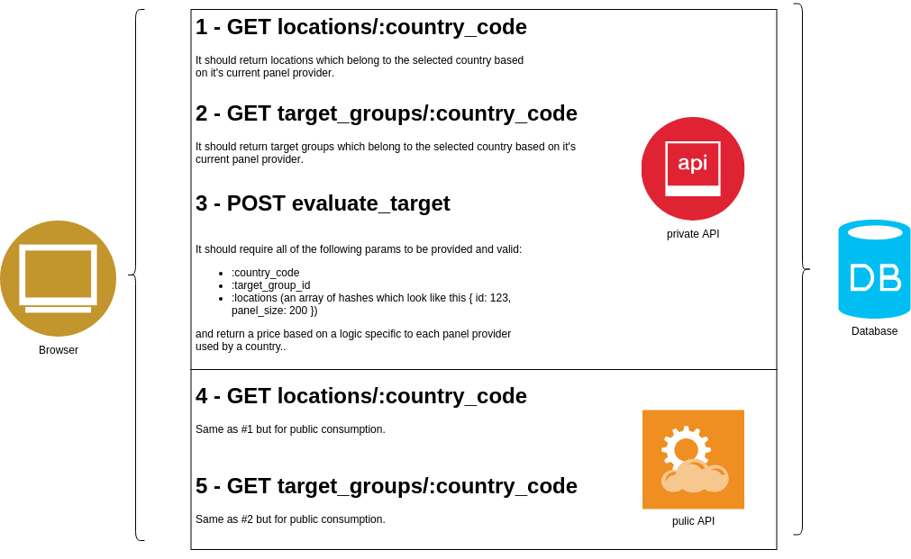

# pricer-api

**[This repository is the solution of the problem related in this task](https://github.com/wojteko/devtest)**

Prepare a rails application using Ruby , which would have 2 isolated APIs, public and private.

Private API responding to the following requests:

* 1 - GET  locations/:country_code
* 2 - GET  target_groups/:country_code
* 3 - POST evaluate_target

Public API responding to the following requests

* 4 - GET  locations/:country_code
* 5 - GET  target_groups/:country_code

## models

>The application should have:
>- 3 Countries, each with different panel provider
>- 3 Panel Providers
>- 20 Locations of any type (city, region, state, etc.)
>- 4 Location Groups, 3 of them with different provider and 1 would belong to any of them  
>- 4 root Target Groups and each root should start a tree which is minimium 3 levels deep (3 of them with different provider and 1 would belong to any of them)

## request info

